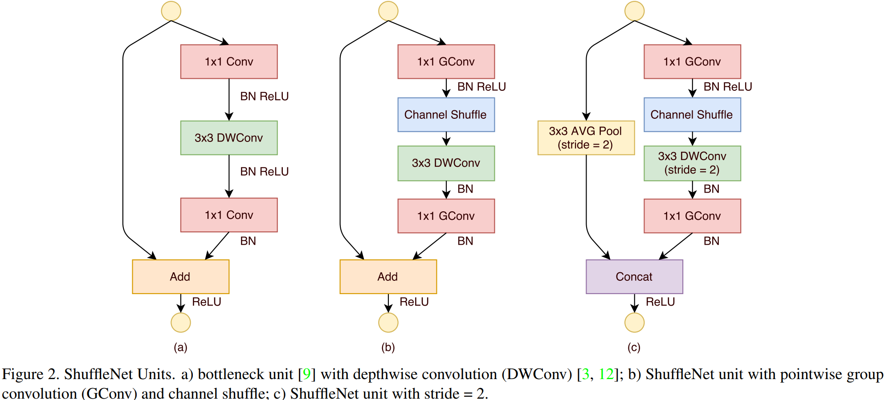
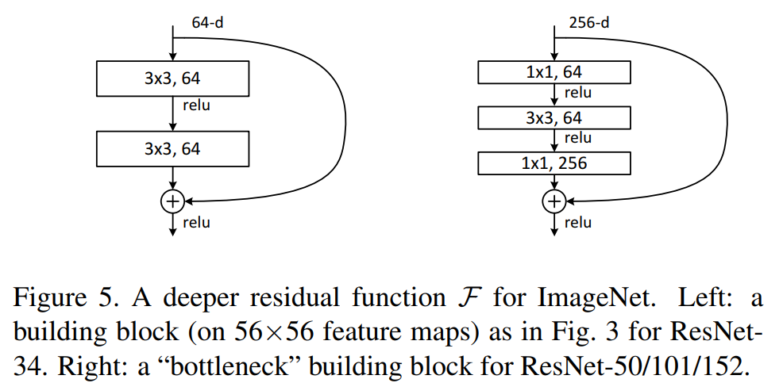

# 图像分类

## 概述

```{note}
待完善。
```

## 论文

### 20170704 ShuffleNet

#### 1 概述

[ShuffleNet: An Extremely Efficient Convolutional Neural Network for Mobile Devices](https://arxiv.org/abs/1707.01083)采用pointwise group convolution及channel shuffle操作构建了一个轻量CNN网络——ShuffleNet。

#### 2 主要内容

- pointwise group convoluiton

pointwise convolution具有不可忽略的计算量，作者通过group convolution来减少其计算量。

- channel shuffle

多个group convolution连续堆叠，会造成特征难以在group之间分享，作者通过channel shuffle来解决这一问题。其代码如下：

```python
def channel_shuffle(feature: Tensor, group: int) -> Tensor:
    """
    :param feature: shape NCHW.
    :param group: group number of the convolution.
    :return: shape NCHW.
    """
    n, c, h, w = feature.size()
    assert c % group == 0

    feature = feature.reshape(n, group, -1, h, w) \
                     .permute(0, 2, 1, 3, 4) \
                     .reshape(n, -1, h, w)
    return feature
```

- ShuffleNet Unit



### 20151210 ResNet

#### 1 概述

[Deep Residual Learning for Image Recognition](https://arxiv.org/abs/1512.03385)提出残差学习（Residual Learning）来解决深度学习中的degradation问题，即：随着DNN不断加深，模型精度逐渐饱和甚至发生下降。

#### 2 主要内容

- 残差学习（Residual Learning）

假设$H(x)$表示DNN一个block欲拟合的函数，残差学习可以表示为：
$$H(x) = F(x) + x$$
其核心思想在于，通过添加Identity Mapping（即$x$），使得该block能够在Identity Mapping的基础上进行函数拟合，原先的block仅需拟合残差函数$F(x)$。残差学习使得网络在加深的时候，能够保持已有网络的能力，解决degration问题。

注意，当$F(x)$与$x$的维度不一致时，论文对$x$进行linear projection来进行对齐。对FC来说，添加一个FC即可；对Conv来说，添加一个$1\times1$的卷积。

- 残差block与ResNet

论文采用了两种残差block（如下图所示），两者通道数不同但具有相当的计算量，后者适用于比较深的DNN以减少计算量。

论文中，前者用在ResNet-{18,34}，后者用在ResNet-{50,101,152}。



#### 3 主要结果

- ResNet随着网络加深，模型精度能够持续提升，未发生degradation问题；
- 在ImageNet2012等公开数据集上，ResNet的结果优于VGG、GoogLeNet、BN-inception等。
