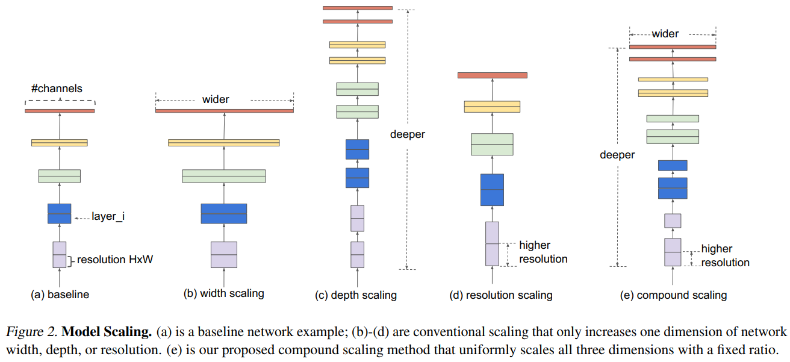
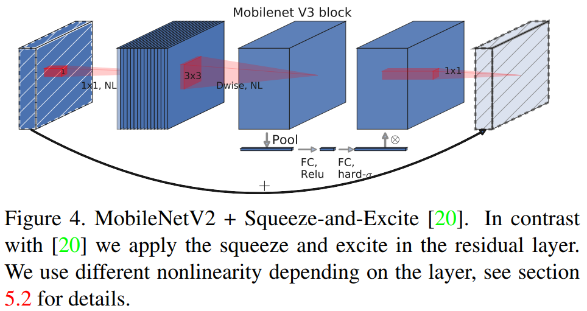
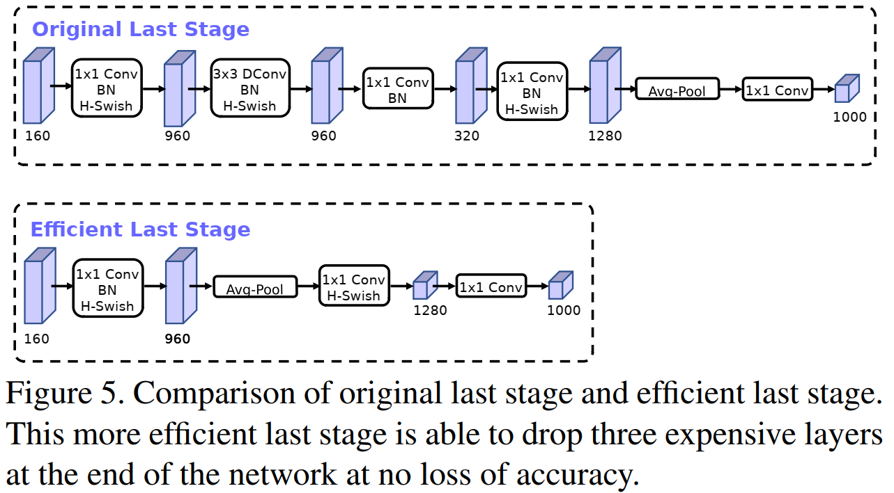
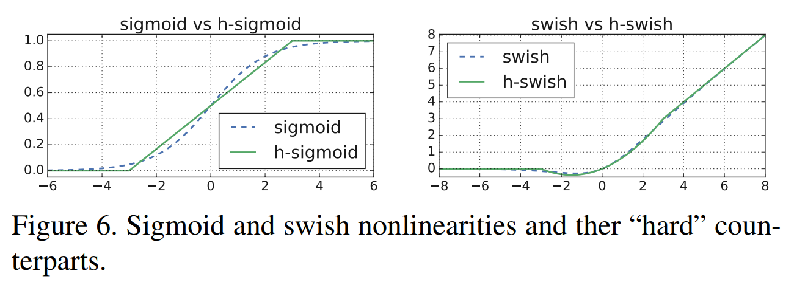
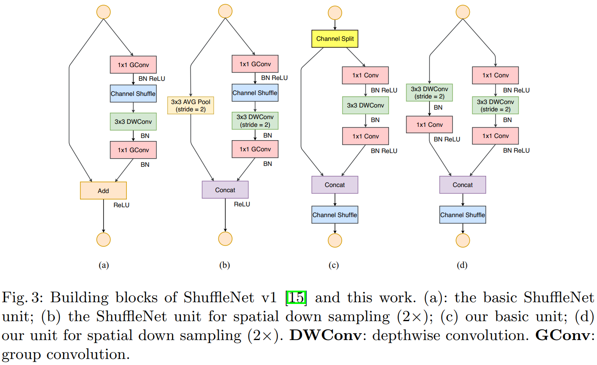
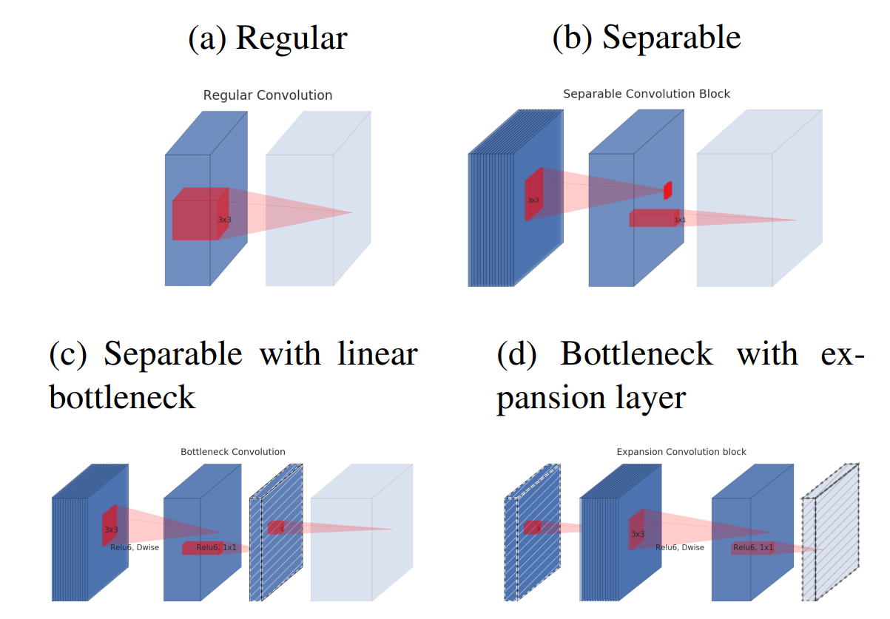
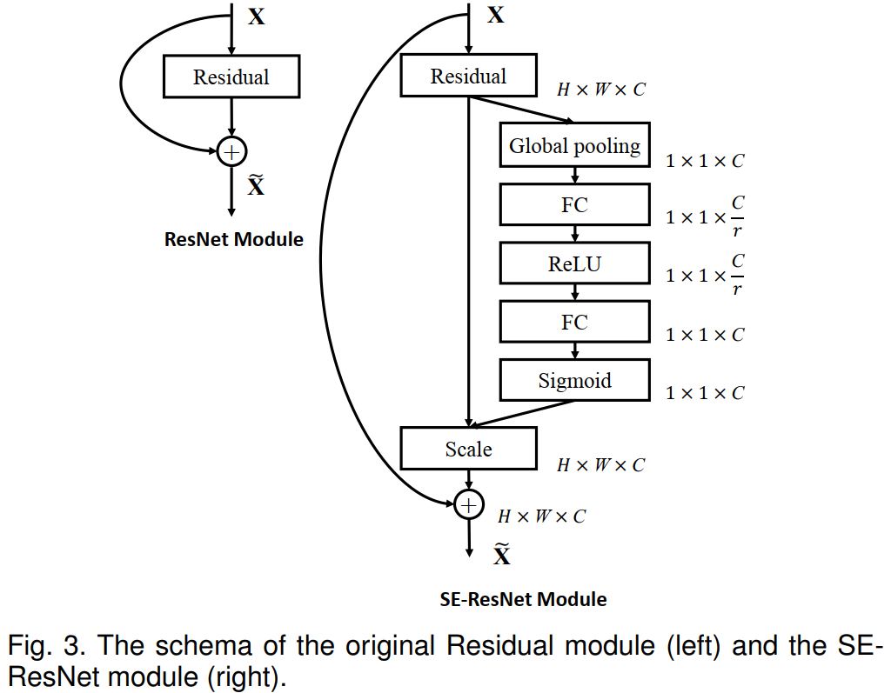
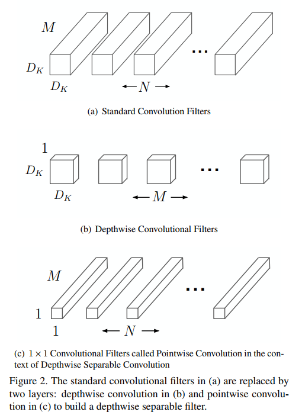
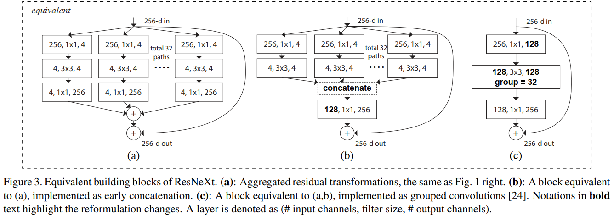

# 图像分类

## 概述

```{note}
待完善。
```

## 论文

### 20191224 BiT

#### 1 概述

[Big Transfer (BiT): General Visual Representation Learning](https://arxiv.org/abs/1912.11370)针对“pre-training + fine-tuning”范式，提出BiT策略，在上游任务基于大量数据对大模型进行预训练，然后通过低成本微调将模型迁移至下游任务。

#### 2 主要内容

- 上游任务：预训练

BiT在预训练时强调了两个要素：1) scale：数据量要大，模型要大；2) GN + WS：论文发现Group Normalization + Weight Standardization优于BN。

基于预训练数据集，论文提供了三个预训练模型BiT-S(ILSVRC-2012)、BiT-M(ImageNet-21k)、BiT-L(JFT-300M)。

- 下游任务：微调

BiT在模型迁移时强调了如下要素：1) traning schedule length；2) resolution；3) whether to use MixUp regularization。

论文提出BiT-HyperRule：tuning the above hyperparameters as a simple function of the task’s intrinsic image resolution and number of datapoints. 

- 大模型及其预训练

论文采用了ResNet152x4大模型，大模型在大数据上的预训练需注意：1) 提供充足的训练；2) A sufficiently large weight decay is required：低weight decay虽然会让模型更快收敛，但会使最终模型的精度受损。

#### 3 主要结果

- BiT-L优于BiT-M优于BiT-S；
- BiT-L优于Generalist SOTA甚至部分Spcialist SOTA；
- BiT-L在Few-Shot下游任务表现优异；
- 在预训练上游任务中，大模型与大数据需搭配使用，仅使用大数据或仅使用大模型可能反而会损害下游任务。

#### 4 阅读小记

在NLP领域，基于Transformer的“pretrain + fine-tuning”获得巨大成功。本文是在CV领域基于CNN的“pretrain + fine-tuning”。

但是，NLP预训练通常是无监督的，而本文的预训练是有监督的。此外，BiT涉及的trick和细节并不trivial。


### 20190528 EfficientNet

#### 1 概述

[EfficientNet: Rethinking Model Scaling for Convolutional Neural Networks](https://arxiv.org/abs/1905.11946)综合调节depth、width、resolution三个因素来获取一系列高效的CNN模型。

#### 2 主要内容

- Model Scaling

depth($d$)、width($w$)、resolution($r$)是三个Model scaling的维度，综合调节三个维度相比于仅调节单个维度能够获得更好的模型精度和模型效率。



论文提出综合协调三个维度的公式。假设$\phi$表示综合调节系数，则三个维度按如下系数进行调节，$d = \alpha^{\phi}$、$w = \beta^{\phi}$、$r = \gamma^{\phi}$，其中常数满足$\alpha\beta^2\gamma^2\approx2, \alpha\geq1,\beta\geq1,\gamma\geq1$。

由上述公式，FLOPs的调节结果近似于$(\alpha\beta^2\gamma^2)^\phi\approx2^\phi$。

```{note}
常量$\alpha$、$\beta$、$\gamma$的值通过对模型Grid Search确定。
```

- 模型结构

EfficientNet的Building Block为添加了SE Block的MobileNetV2 Block。

论文采用Mansnet类似的NAS方法搜索得到EfficientNet-B0，进而基于上述Model scaling方法得到EfficientNet-B1~7。

#### 3 主要结果

- 在相当模型精度下，EfficientNet相比ResNet、DenseNet、SENet等能够减少8.4~16倍计算量；
- 综合调节depth、width、resolution优于单独调节单个维度，该规律适用于EfficientNet-B0及MobileNetV2、ResNet等。

#### 4 阅读小记

除论文提出的EfficientNet外，Github上还提供了适用于移动端的[EfficientNet-Lite](https://github.com/tensorflow/tpu/blob/master/models/official/efficientnet/lite/README.md)，主要改动如下：1) 由于SE在部分移动端支持不好，去除SE Block；2) 将swish替换为ReLU6，以便于量化；3) 调节模型时，固定stem与head，使模型更为轻量。


### 20190506 MobileNetV3

#### 1 概述

[Searching for MobileNetV3](https://arxiv.org/abs/1905.02244)结合NAS(Network Architectrue Search)及网络结构新的研究进展设计了MobileNetV3。

#### 2 主要内容

- Building Block

MobileNetV3的基础Block如下图所示，相比于MobileNetV2 Block有如下改进：1) 在DWise卷积后添加了SE Block；2) 采用hard-sigmoid替换SE中的sigmoid，采用hard-swish替换部分ReLU激活函数。



- NAS

论文串联了两种NAS方法：1) 采用Mnasnet相同的方法搜索全局网络结构；2) 采用NetAdapt对上述全局网络结构的individual layer进行搜索微调。

- 手工改进

论文首先对Expensive Layer进行了重新设计，包括：1) last stage：调整PWise卷积的位置并去除无用的网络层（如下图所示）；2) initial set of filters：采用hard-swish后，将卷积核数量由32减为16。



其次，论文采用新的非线性函数替换sigmoid及部分ReLU，即$\text{h-swish}(x) = x\frac{\text{ReLU6}(x+3)}{6}$及$\text{h-sigmoid}(x) = \frac{\text{ReLU6}(x+3)}{6}$（备注：$\text{swish}(x) = x\sigma(x)$）。



```{note}
hard swish相比ReLU计算量大，因而论文仅在网络后半部分替换ReLU为hard swish。
```

#### 3 主要结果

- 在相同FLOPs下，MobileNetV3优于MobileNetV2、ShuffleNetV2、Mnasnet等；
- 在模型精度上h-swish激活函数优于ReLU，但h-swish比ReLU计算量大。

#### 4 阅读小记

“NAS + 手工改进”可能是当前网络设计的标准范式。


### 20180730 ShuffleNetV2

#### 1 概述

[ShuffleNetV2: Practical Guidelines for Efficient CNN Architectrue Design](https://arxiv.org/abs/1807.11164)指出模型实际运行的速度不仅仅依赖于模型的理论计算量FLOPs，还依赖于访存、目标硬件等，据此提出4条模型设计的准则，并改进得到ShuffleNetV2。

#### 2 主要内容

- Efficient模型的设计准则（在模型理论计算量FLOPs不变的前提下）
  1. Equal channel width minimizes memory access cost (MAC) -> use balanced convolutions with equal channel width;
  2. Excessive group convolution increases MAC -> be aware of the cost of using group convolutions;
  3. Network fragmentation reduces degree of parallelism -> reduce the degree of fragmentation;
  4. Element-wise operations are non-negligible -> reduce element-wise operations.

- ShuffleNetV2

ShufflenNetV2的基本Block如下图所示，按上述准则进行的改进包括：1)采用concat + channel shuffle + channel split（三个操作可合并为单个element-wise操作），避免pointwise卷积采用分组卷积，消除最终的Add操作，以满足准则2/4；2)保持卷积层通道数一致，以满足准则1。

除此之外，相比于ShuffleNetV1还有如下改动：1)在global averaged pooling之前添加了一层pointwise卷积；2)下采样shortcut上使用`stride=2`的深度可分离卷积进行对齐。



```{note}
在ShuffleNetV2中，由于channel split及shortcut，部分输入未经任何处理直接传入了下一层，这类似于DenseNet的feature reuse。

同时，由于channel shuffle，相距较远的层之间存在极少的feature reuse。
```

#### 3 主要结果

- 在相同理论计算量FLOPs下，ShuffleNetV2相比于ShuffleNetV1、MobileNetV1&V2等具有更高的精度和更快的推理速度；
- ShuffleNetV2可以扩展到较大模型，与ResNet-50/SENet相比较，能够在更低理论计算量下获得更高的精度。

#### 4 阅读小记

模型实际推理速度受FLOPs、MAC等多个因素影响，针对具体的目标硬件，模型选择需要综合考量FLOPs、MAC等因素。


### 20180113 MobileNetV2

#### 1 概述

[MobileNetV2: Inverted Residuals and Linear Bottlenecks](https://arxiv.org/abs/1801.04381)提出Inverted Residual及Linear Bottleneck来改进卷积Block，构建适用于移动端的MobileNetV2。

#### 2 主要内容

- Linear Bottleneck及Inverted Residual

下图中：图(a)是传统卷积（激活函数未标记），长方体代表卷积层输出的未经激活函数激活的特征图（下同）；图(b)是深度可分离卷积（激活函数未标记）；图(c)是深度可分离卷积 + Linear Bottleneck，整个block的输入输出是高维特征图；图(d)是Linear Bottleneck + 深度可分离卷积，整个block的输入输出是Bottleneck。

将图(d)中Bottleneck通过shortcut相连即为Inverted Residual Block，这是论文采用的基础Block。



```{note}
在MobilenetV2中，下采样的卷积block(即stride==2)，没有shortcut，而在ResNet、ShuffleNet等网络中，会在shortcut上进行对齐。
```

- 复杂度

Inverted Residual Block参数量为$hwdt(d + k^2 + d)$，其中$t$为expansion ratio。

Inverted Residual Block中shortcut相连的是bottleneck，相比于传统的Residual Block，在推理过程中能够减少访存，进而提高推理速度。

- Manifold of Interest (MOI)

论文基于流形学习来解释提出的CNN Block。通常假设，神经网络的MOI嵌入在一个低维空间中。

采用ReLU激活函数的CNN有如下特性：1)经ReLU后，若MOI的体积不为空，那么这部分体积对应了一个线性变换；2)经ReLU后MOI蕴含的信息能够得以完整保留的条件是，MOI嵌入在输入空间的一个低维空间中。

基于上述分析，论文借助低维的bottleneck来捕获MOI，同时采用linear避免nonlinear破坏MOI中蕴含信息；此外，论文认为bottleneck包含了MOI的主要信息，而“Expansion + 深度可分离卷积”只是非线性的一种实现方式，所以将shortcut连接在了bottleneck之上。

#### 3 主要结果

- 在相同计算量下，MobileNetV2优于MobileNetV1，与NasNet、ShuffleNet效果相当；
- linear bottleneck优于nonlinear bottleneck；
- shortcut between bottleneck优于shortcut between expansion layer优于without shortcut。

#### 4 阅读小记

- Linear Bottleneck在之前的研究当中已被应用，例如ShuffleNet等；
- 论文基于MOI解释了Linear Bottleneck及Inverted Residual的设计思想，但MOI的理论尚无法系统地解释DNN的原理，企图通过MOI来解释其它论文的设计思想并不现实。在与其它论文比较的时候，关注Block本身的结构更为现实。


### 20170905 Squeeze and Excitation

#### 1 概述

[Squeeze and Excitation Networks](https://arxiv.org/abs/1709.01507)提出SE Block用于建模通道之间的关系、调整各通道的输出。

#### 2 主要内容

- SE Block

以SE-ResNet为例（如下图所示），SE Block包括两部分：Squeeze和Excitation。

**Squeeze: Global Information Embedding**：对特征图进行全局平均池化，得到各特征图的全局特征。

**Excitation: Adaptive Recalibration**：用两次FC将全局特征转换为各特征图的调整系数，与特征图相乘。



```{note}
SE Block可以应用于ResNet Block的不同位置，效果基本一致。

除ResNet之外，SE Block同样可以用于提升ResNeXt、MobileNet、ShuffleNet等。
```

- 复杂度

SE Block的参数量主要来源于两次FC，即$2C^2/r$，其中$r$用于平衡精度与引入的复杂度。对于轻量模型来说，两次FC引入的参数量与pointwise convolution相当，但引入的理论计算量很小。

#### 3 主要结果

- 在ImageNet数据集上，ResNet、ResNeXt、VGG-16、BN-Inception经SE增强后，能提升0.5~1.5个百分点，引入的额外计算量和参数量很小；
- 在ImageNet数据集上，MobileNet、ShuffleNet经SE增强后，能提升1.5~3个百分点，引入的参数量较大，但引入的理论计算量较小；
- SE Block对$r$的取值不敏感，可以选取一个合适的值来平衡精度与引入的复杂度；
- 对于Squeeze来说，全局平均池化略优于全局最大池化；
- SE在不同深度的卷积层中呈现的效果有所不同，在低层中SE表现得class-agnositc，在高层中class-dependent。

#### 4 阅读小记

- SE形式上与作用上类似于Attention机制。
- 虽然SE引入的理论计算量较小，但实际部署中可能会造成一定时延。


### 20170704 ShuffleNet

#### 1 概述

[ShuffleNet: An Extremely Efficient Convolutional Neural Network for Mobile Devices](https://arxiv.org/abs/1707.01083)指出pointwise convolution具有不可忽视的计算量，论文通过pointwise group convolution及channel shuffle来减少其计算量，构建适用于移动端的轻量网络。

#### 2 主要内容

- pointwise group convoluiton与channel shuffle

深度可分离卷积中pointwise convolution占据主要的计算量，论文通过分组卷积来减少其计算量。

但是，多个group convolution连续堆叠，会造成特征难以在group之间分享，论文通过channel shuffle来解决这一问题。其代码如下：

```python
# 代码来源：https://pytorch.org/vision/stable/_modules/torchvision/models/shufflenetv2.html
def channel_shuffle(x: Tensor, groups: int) -> Tensor:
    batchsize, num_channels, height, width = x.size()
    channels_per_group = num_channels // groups

    # reshape
    x = x.view(batchsize, groups, channels_per_group, height, width)

    x = torch.transpose(x, 1, 2).contiguous()

    # flatten
    x = x.view(batchsize, -1, height, width)

    return x
```

- ShuffleNet Block

ShuffleNet基本block如下图(b)(c)所示。其中，图(a)是类似于ResNet的bottleneck block，中间采用DWConv；图(b)(c)采用了pointwise group convoluiton与channel shuffle，值得注意的是DWConv后没有激活函数。

假设输入大小为$chw$，bottleneck的通道数为$m$，则图(a)计算量为$hw(2cm + 9m)$，图(b)计算量为$hw(2cm/g + 9m)$。


- scale factor

类似于MobileNet，ShuffleNet提供了宽度乘子来调节模型计算量（调整结果近似于平方）。

#### 3 主要结果

- 保持计算量基本不变，随着pointwise group convolution分组数提高，模型精度基本呈上升趋势；
- with shuffle相比without shuffle，模型精度能够提升2~5百分点；
- 相同计算量下，ShuffleNet优于MobileNet、VGG-like、ResNet、Xception-like、ResNeXt等模型；
- 由于访存等因素，ShuffleNet减少计算量带来的理论加速效果低于实际加速效果。

#### 4 阅读小记

- 通过channel shuffle解决连续分组卷积共享信息的问题，十分巧妙。
- 由于实现、访存等原因，基于理论计算量得到的加速效果并不可靠。


### 20170417 MobileNet

#### 1 概述

[MobileNets: Efficient Convolutional Neural Networks for Mobile Vision Applications](https://arxiv.org/abs/1704.04861)基于depthwise separable convolution构建了适用于移动端的轻量网络。

#### 2 主要内容

- depthwise separable convolution

深度可分离卷积如下图所示，其中：$M$为输入通道，$N$为输出通道，$D_K$为卷积核大小。

深度可分离卷积参数量为$MD_KD_K + MN$，传统卷积参数量为：$MND_KD_k$，两者相比为$1/N + 1/(D_KD_K)$。一般而言，$N >> D_KD_K$，所以在深度可分离卷积中参数量主要来源于pointwise convolution。



- Width Multiplier/Resolution Multiplier

MobileNet通过宽度乘子$\alpha$和分辨率乘子$\rho$来调整模型的计算量（调整效果近似于平方），以适应不同的计算资源。

#### 3 主要结果

- 假设卷积核尺寸为$3\times3$，则深度可分离卷积的计算量近似为传统卷积的$1/9$~$1/8$；
- 保持计算量近似不变，减少网络深度对模型的损害比减少网络宽度更大；
- MobileNet与GoogleNet、VGG16在ImagNet数据集上结果相当，但计算量小得多。

#### 4 阅读小记

- 深度可分离卷积能够有效减少传统卷积的计算量，在轻量CNN网络中被广泛使用。
- 第一代MobileNet未采用类似于ResNet的shortcut + Block的结构，模型精度仍有提升的空间。


### 20161116 ResNeXt

#### 1 概述

[Aggregated Residual Transformations for Deep Neural Networks](https://arxiv.org/abs/1611.05431v2)采用split-transfrom-aggregate的方式对ResNet进行了改进。

#### 2 主要内容

- Split-Transform-Aggregate

ResNeXt主要改进点如下图(a)所示，对ResNet bottleneck block进行split-transform-aggregate，其与图(b)图(c)等价。论文在实现时主要采用了图(c)分组卷积。



```{note}
ResNeXt的改进点仅适用于ResNet的bottleneck block，对ResNet两层Layer的blcok并不适用。
```

#### 3 主要结果

- 在同等计算量下，ResNeXt的结果要优于ResNet；
- 在同等计算量下，随着分组卷积组数的提高，模型的精度呈上升趋势。

#### 4 阅读小记

本质上，ResNeXt通过分组卷积节省了计算量，在同等计算量下，ResNeXt相比ResNet能够使用更多的通道，从而提升了模型精度。


### 20151210 ResNet

#### 1 概述

[Deep Residual Learning for Image Recognition](https://arxiv.org/abs/1512.03385)提出残差学习（Residual Learning）来解决深度学习中的degradation问题，即：随着DNN不断加深，模型精度逐渐饱和甚至发生下降。

#### 2 主要内容

- 残差学习（Residual Learning）

假设$H(x)$表示DNN一个block欲拟合的函数，残差学习可以表示为：$F(x) = H(x) - x$。

其核心思想在于，通过添加Identity Mapping（即$x$），使得该block能够在Identity Mapping的基础上进行函数拟合，原先的block仅需拟合残差函数$F(x)$。残差学习使得网络在加深的时候，能够保持已有网络的能力，解决degration问题。

```{note}
当$F(x)$与$x$的形状不一致时，需在shortcut上将$x$与$F(x)$进行对齐。
```

- 残差block与ResNet

论文采用了两种残差block（如下图所示），两者通道数不同但具有相当的计算量，后者（bottleneck blcok）适用于比较深的DNN以减少计算量。

论文中，前者用在ResNet-{18,34}，后者用在ResNet-{50,101,152}。


#### 3 主要结果

- ResNet随着网络加深，模型精度能够持续提升，未发生degradation问题；
- 在ImageNet2012等公开数据集上，ResNet的结果优于VGG、GoogLeNet、BN-inception等。

#### 4 阅读小记

论文以"残差学习"来解释ResNet的成功。从梯度的角度来看，shortcut使得梯度更容易传播到低层网络，缓解了梯度消失问题。
