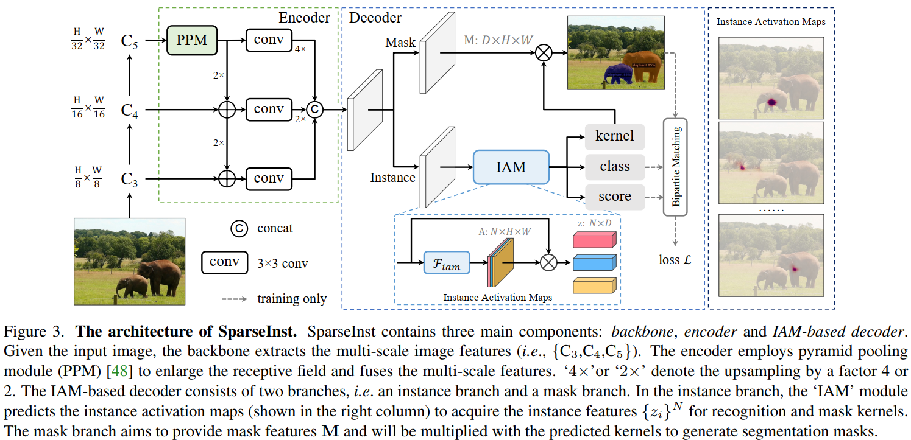
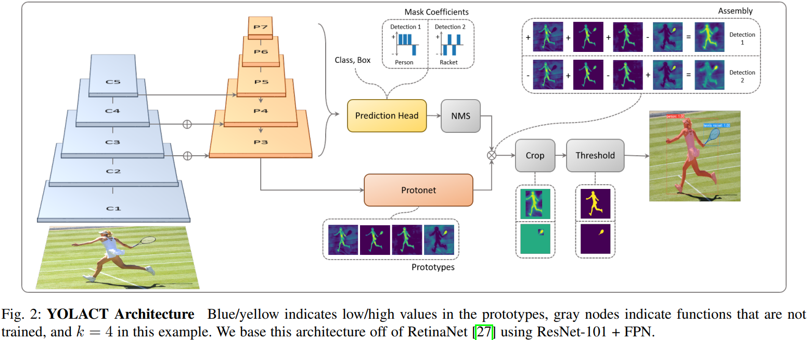
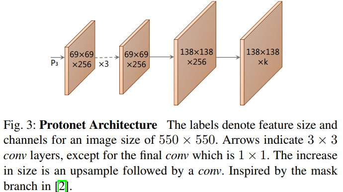

# 实例分割

## 概述

## 论文

### 20220324 SparseInst

#### 1 概述

[Sparse Instance Activation for Real-Time Instance Segmentation](https://arxiv.org/abs/2203.12827)基于稀疏的Instance Activation Maps (IAM)来获取实例特征进行实例分割，并采用二部图匹配（bipartite matching）作Assignment避免了NMS后处理，取得了优异的推理性能和模型精度。

#### 2 主要内容

* 模型结构

SparseInst模型结构如下图所示，主要包括backbone、encoder、decoder三个部分：1) backbone采用ResNet等，保留C3-C5；2) encoder经Top-Down后，将P3-P5合并，其中C5额外通过PPM（Pyramid Pooling Module）以扩大感受野；3）decoder含有两个分支，instance分支基于IAM获取实例特征$z \in \mathbb{R}^{N \times D}$，进而通过3个FC预测实例类别、objectness（IoU）及mask kernel，其中kernel（$w \in \mathbb{R}^{N \times D}$）与mask分支提供的mask特征（$M \in \mathbb{R}^{D \times H \times W}$）结合预测实例mask，即$m = wM$。

decoder在encoder输出的基础上，添加了2个channel的location-sensitive features，即normalized absolute (x, y) coordinates。

* IAM

IAM的计算方式为$\textbf{A} = F_{iam}(\textbf{X}) \in \mathbb{R}^{N \times (H \times W)}$，其中$\textbf{X} \in \mathbb{R}^{D \times (H \times W)}$，$F_{iam}$采用$3 \times 3$卷积及sigmoid激活函数。IAM经normalize后，获取实例特征，即$z = \overline{\textbf{A}} \textbf{X}^\top \in \mathbb{R}^{N \times D}$。

为获取更多实例特征，可采用Group-IAM，即每个实例对应一组IAM（论文以4个作为一组），组内IAM得到的特征通过concatenating得到最终的实例特征（官方代码通过分组卷积实现Group-IAM）。

* 训练

Ground Truth的Assignment策略采用二部图匹配，第$i$个预测实例（$m_i$表示预测mask）与第$k$个GT（$c_k$表示GT类别，$t_k$表示GT mask）的匹配Score定义为$C(i,k) = p_{i, c_k}^{1 - \alpha}\text{DICE}(m_i, t_k)^\alpha$，其中$\alpha$用于调节分类与分割的权重（论文取0.8），$\text{DICE}(m, t)=\frac{2\sum_{x,y}m_{xy}t_{xy}}{\sum_{x,y}m_{xy}^2 + \sum_{x,y}t_{xy}^2}$（式中$m,t$表示预测maks及GT mask在坐标$x,y$处的值）。

损失定义为$L = \lambda_cL_{cls} + L_{mask} + \lambda_sL_s$，其中：$L_{cls}$为分类损失，论文采用Focal Loss；$L_{mask}$为mask损失，论文采用$L_{mask} = \lambda_{dice}L_{dice} + \lambda_{pix}L_{pix}$综合dice loss及binary cross entropy loss；$L_s$为IoU对应的损失。

* 推理

前向推理获得$N$个实例的分类预测$p_i$、objectness预测$s_i$、mask预测$m_i$，综合分类及objectness预测得到最终得分$\hat{p_i} = \sqrt{p_i s_i}$，对$\hat{p_i}$及$m_i$作thresholding直接确定最终实例类别和mask，无需NMS和sorting。

备注：在官方代码实现中，在推理时预测得分$\hat{p_i}$还进一步依据$m_i$的预测质量作了一次更新。

#### 3 主要结果

* 在COCO数据集上，SparseInst模型精度和推理性能综合能力优于SOLOV2及YOLOLACT++。
* 不同的IAM对不同的location、scale、shape敏感，这些contribute to IAM区别不同实例的能力。

#### 4 阅读小记

* SparseInst基于稀疏的IAM作实例分割，采用二部图匹配作Assignment，不仅大大减少预测结果并且避免了NMS等后处理，是一种新颖的实例分割方法。
* SparseInst基于IAM直接区分不同实例，不同于基于Anchor+NMS区分不同实例的方法，值得进一步探究。

### 20211019 maYolact

#### 1 概述

[Mask-aware IoU for Anchor Assignment in Real-time Instance Segmentation](https://arxiv.org/abs/2110.09734)指出传统IoU仅考虑了Box的面积，未考虑目标的形状（mask），提出maIoU（mask-aware IoU）来解决上述问题，提高了YOLACT的模型精度。

#### 2 主要内容

* maIoU的定义与计算

论文中maIoU主要用于训练阶段作Assignment，其核心思想为：promote on-mask pixels while preserving the total energy。

为计算maIoU，引入如下表示：1）记Anchor Box为$\hat{B}$，GT Box为$B$，GT MASK为$M$，on-mask pixel权重为$w$，off-mask pixel权重为$\overline{w}$；2）MOB（Mask-over-box）：$\text{MOB}(B, M) = \frac{|B \cap M|}{|B|}$。

传统IoU中交集可以表示为$I(B, \hat{B}) = \sum_{i \in \hat{B} \cap M}w + \sum_{i \in (\hat{B} \cap B - \hat{B} \cap M)}\overline{w}$，其中$w = \overline{w} = 1$。

maIoU令$\overline{w} = 0$，并将off-mask pixel的权重分摊至on-mask以preserve total energy，即$w = 1 + \frac{|B| - |M|}{|M|} = \frac{|B|}{|M|} = \frac{1}{\text{MOB}(B, M)}$，则$\text{maIoU}(\hat{B}, B, M) = \frac{\sum_{i \in \hat{B} \cap M}w}{|\hat{B} \cup B|} = \frac{|\hat{B} \cap M|}{\text{MOB}(B, M)|\hat{B} \cup B|}$。

为快速计算maIoU，用$\Theta \in \mathbb{R}^{m+1, n+1}$记录图片左上部分on-mask pixel的数量，则$|M| = \Theta[m, n], |B \cap M| = \Theta[x_2, y_2] + \Theta[x_1 - 1, y_1 - 1] - \Theta[x_1 - 1, y_2] - \Theta[x_2, y_1 - 1]$，由此可快速计算出$\text{MOB}(B, M)$及Anchor对应的maIoU。

* maYolact

相比Yolact，maYolact做了如下优化：替换Assigner为ATSS+maIoU；采用DCNv2；优化Anchor；优化学习率等。

#### 3 主要结果

* 用作Assigner时，ATSS+maIOU优于ATSS+IoU/DIoU/GIoU；
* maYolact模型精度与推理速度综合能力优于Yolact&Yolact++，略优于SoloV2。

#### 4 阅读小记

maIoU考虑了目标的形状（mask），相比Traditional-IoU (tIoU)，当交集中mask占比较大时，maIoU > tIoU，当交集中mask占比较小时，maIoU < tIoU。

### 20200323 SOLOV2

[SOLOv2: Dynamic and Fast Instance Segmentation](https://arxiv.org/abs/2003.10152)

### 20191210 SOLO

[SOLO: Segmenting Objects by Locations](https://arxiv.org/abs/1912.04488)

### 20190404 Yolact

#### 1 概述

[YOLACT: Real-time Instance Segmentation](https://arxiv.org/abs/1904.02689)基于prototype mask及per-instance mask coefficients进行实例分割，并提出Fast NMS进一步提升推理速度，实现实时实例分割。

[YOLACT++: Better Real-time Instance Segmentation](https://arxiv.org/abs/1912.06218)在YOLACT基础上，通过采用可变形卷积、优化anchor、引入mask re-scoring分支等，进一步提升了实例分割的精度。

备注：YOLACT (You Only Look At CoeffcienTs)。

#### 2 主要内容

* 模型结构

主干采用RestNet；Neck采用FPN；检测头每个Anchor除了输出$c$个类别confidence、4个框预测值外，还会输出$k$个mask coefficients（为使能减法，激活函数采用tanh），表示为$C \in \mathbb{R}^{n \times k}$（$n$泛指$n$个实例），检测头三个分支共享卷积参数。

Protonet采用FCN，输入为P3，输出时upsample到原图的1/4，输出为$k$个prototype（激活函数采用ReLU），表示为$P \in \mathbb{R}^{h \times w \times k}$。

Mask最终预测结果由$M = \sigma(PC^\top)$得到。

Yolact++为处理cls_confidence与mask预测质量不一致的问题，引入mask re-scoring分支对mask的IoU进行预测，其以cropped 0-padded unthresholded mask作为输入，通过6-layer FCN with ReLU外加global pooling预测每个类别对应的IoU，该矢量与cls_confidence相乘作为对应类别的最终预测得分。

Yolact++引入了DCN，为平衡精度与速度，采用了interval=3间隔DCN的方式。

* 训练

损失函数包括三部分：$L = \lambda_{cls}L_{cls} + \lambda_{box}L_{box} + \lambda_{mask}L_{mask}$，其中论文取$\lambda_{cls} = 1, \lambda_{box} = 1.5, \lambda_{mask} = 6.125$，$L_{cls}$、$L_{box}$与SSD一致，而$L_{mask} = \text{BCE}(M, M_{gt})$。

训练时Mask预测结果由GT BBox作crop，并由GT BBox的面积对$L_{mask}$作normalize。

为提升模型精度，论文在训练时在P3上引入了语义分割分支，参与损失计算与反向梯度传播，不参与推理。

* 推理与Fast NMS

推理时Mask预测结果由预测的BBox作Crop。

Fast NMS主要思想为：允许already-removed预测结果抑制其它预测结果，以使NMS变为GPU-accelerated操作。具体而言，以$X \in \mathbb{R}^{n \times n}$表示$n$个预测结果的IoU，将$X$下三角及对角线置为0，取$X$的column-max，进而对上述矢量作thresholding即可得到保留的预测结果。

#### 3 主要结果

* 卷积层由于padding，本身是translation variant，即feature map携带了position信息，借助于此特性，不同的prototype能够对图片不同的partition敏感。
* 过少的prototype会降低精度，但过多的prototype并不会提高精度，论文取$k = 32$。
* Fast NMS相比传统NMS，精度会略有降低（0.1~0.3mAP），但速度会有提升（11~15ms）。
* Yolact++精度稍差于Mask R-CNN，但速度快很多。

#### 4 阅读小记

* Yolact依赖BBox对mask作crop，需要准确的BBox预测结果。
* 通过mask coefficients对prototype作线性组合预测mask的方法值得进一步探究。过多的prototype无法提高精度，可能意味着上述方法存在瓶颈。
