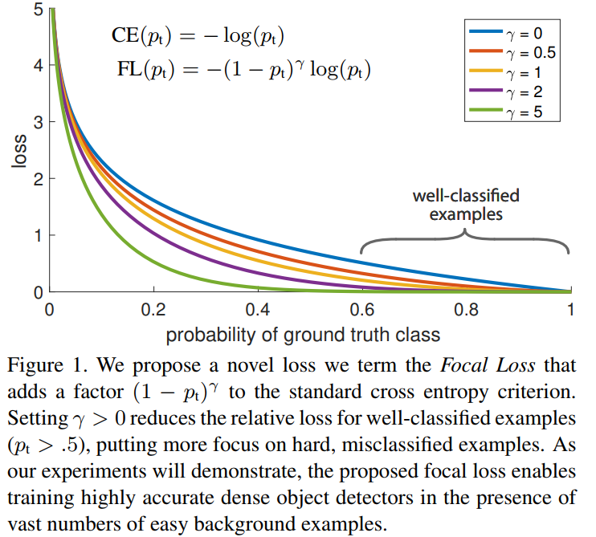
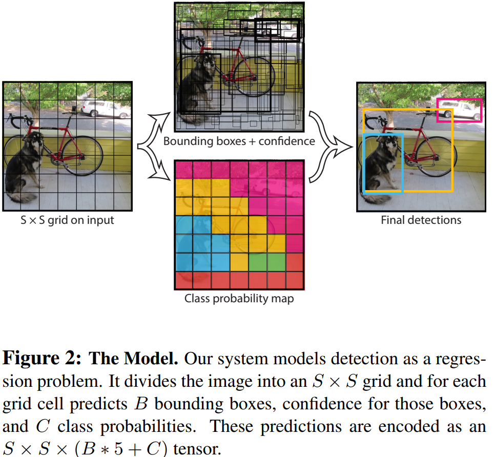
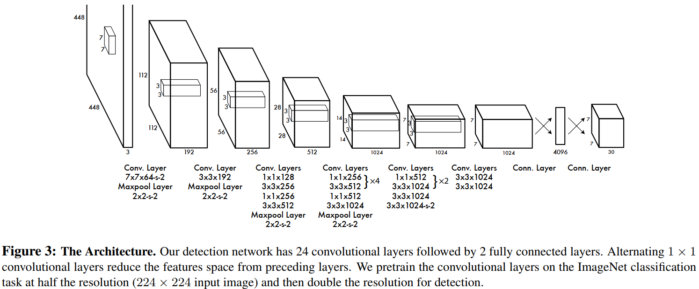

# 目标检测

## 概述

## 论文

### 20170807 Focal Loss (RetinaNet)

#### 1 概述

[Focal Loss for Dense Object Detection](https://arxiv.org/abs/1708.02002)指出class imbalance是损害一阶段目标检测模型精度的主要原因，提出Focal Loss来解决class imbalance问题，并构建一阶段目标检测模型RetinaNet，证明了Focal Loss的有效性。

#### 2 主要内容

* Focal Loss

记模型类别预测概率为：

$p_t = \begin{cases}
p & y = 1 \\
1 - p & otherwise \\
\end{cases}$

则传统的交叉熵Cross Entropy (CE)可以表示为$\text{CE}(p_t) = -\log(p_t)$，Balanced CE可以表示为$\text{CE}(p_t) = -\alpha_t \log(p_t)$（其中，$\alpha_t$的定义与$p_t$类似，用于调整正负样本的权重）。

论文定义Focal Loss为$\text{FL}(p_t) = -(1 - p_t)^\gamma \log(p_t)$，用于down-weight easy example（如下图所示），使得模型训练关注于hard negatives，以解决class imbalance问题。



在实践中，论文采用Balaced FL，即$\text{FL}(p_t) = -\alpha_t(1 - p_t)^\gamma \log(p_t)$，其中取$\gamma = 2, \alpha = 0.25$。

```{note}
为提升Focal Loss训练的稳定性，论文在初始化classification layer时，会将少数类（即前景类）的预测概率初始化为一个较小的值，例如0.01，使得模型在初始时就关注少数类。
```

* RetinaNet

RetinaNet整体结构如下图所示，Backbone采用ResNet，Neck采用FPN，Head是Anchor-based（$A=9$），具有分类与框回归（class-agnostic）两个分支，两个分支网络结构相同，参数不共享。

模型训练时，Anchor Assignment基于iou（高于0.5视为前景，低于0.4视为背景，未assigned的archor在训练中忽略），损失包括两部分：分类的Focal Loss以及框回归的损失，其中Focal Loss基于assigned前景的anchor的数量作normalized，而不是全部anchor。

模型推理时，各scale仅保留阈值0.05以上最多1k的预测结果，合并后作NMS，以提高推理速度。


#### 3 主要结果

* Balanced FL优于Balanced CE；
* 9个Anchor的结果优于单个Anchor；
* FL优于OHEM等其它解决一阶段目标检测class imbalance的方法；
* RetinaNet+FL具有一阶段目标检测的速度与二阶段目标检测的精度。

#### 4 阅读小记

二阶段目标检测模型通过Region Proposal及Sampling规避了class imbalance问题，Focal Loss为一阶段目标检测提供了一种解决class imbalance的方法。


### 20150608 YOLO

#### 1 概述

[You Only Look Once: Unified, Real-Time Object Detection](https://arxiv.org/abs/1506.02640)提出高效的Anchor-Free的一阶段目标检测模型用于实时目标检测。

#### 2 主要内容

* 模型

YOLO基本思想如下图所示，输入图片划分为$S \times S$个网格（grid cell），每个网格预测$B$个Bounding Box，每个检测框包含$x, y \in [0, 1]$（相对于网格）、$w, h \in [0, 1]$（相对于图片）、$confidence = \Pr(\text{Object}) \times \text{IOU}_{\text{pred}}^{\text{truth}}$5个值）和$C$个类别概率$\Pr(\text{Class}_i|\text{Object})$。

网格中每个检测框的confidence与每个类别的预测概率相乘即可得到$\Pr(\text{Class}_i) \times \text{IOU}_{\text{pred}}^{\text{truth}}$，该值综合描述了每个检测框的class与location。




YOLO模型结构如下图所示，图片经resize后，输入CNN+FC组成的网络，输出大小为$S^2(5B + C)$的Tensor。



* 训练

Assignment策略：目标中心所在网格负责该目标的检测（即$\mathbb{1}_{i}^\text{obj}$），进一步，该网格中与GT的IOU最高的Box负责该目标的检测（即$\mathbb{1}_{ij}^\text{obj}$）。

损失函数基于Sum-Squared Error，包括三个部分：$L = L_{\text{coord}} + L_{\text{confidence}} + L_{class}$。其中：

$L_\text{coord} = \lambda_{\text{coord}}\sum_{i=0}^{S^2} \sum_{j=0}^{B} \mathbb{1}_{ij}^\text{obj}[(x_i - \hat{x}_i)^2 + (y_i - \hat{y}_i)^2 + (\sqrt{w_i} - \sqrt{\hat{w}_i})^2 + (\sqrt{h_i} - \sqrt{\hat{h}_i})^2]$

$L_{\text{confidence}} = \sum_{i=0}^{S^2} \sum_{j=0}^{B} (\mathbb{1}_{ij}^\text{obj}+ \lambda_{\text{noobj}}\mathbb{1}_{ij}^\text{noobj})(C_i - \hat{C}_i)^2 $

$L_{class} = \sum_{i=0}^{S^2} \sum_{c \in \text{classes}}(p_i(c) - \hat{p}_i(c))^2$

```{note}
论文设$\lambda_{\text{coord}} = 5$，以平衡coord损失与其它损失；论文设$\lambda_{\text{noobj}} = 0.5$，以减小不含目标网格对应confidence损失；论文将$w, h$开方，以平衡大目标与小目标的损失。
```

* 推理

YOLO输出$S^2B$个检测框和对应的类别概率，经NMS后得到最终检测结果。

#### 3 主要结果

* YOLO与Fast/Faster R-CNN相比，推理速度快，模型精度低；
* YOLO与Fast R-CNN相比，定位效果差，但不易犯False Positive错误；
* YOLO与R-CNN相比，泛化到Art等数据场景效果好。

#### 4 阅读小记

* YOLO系列的开山之作；
* YOLO未采用Anchor，而是基于Grid Cell对检测框进行约束；
* 论文指出YOLO的几个缺陷：1) Cell约束了检测结果的数量，导致YOLO难以预测紧凑在一起小目标；2) Box坐标是基于数据习得的，难以泛化到未见到过的size与ratio；3) 虽然开方了，大小目标coord的损失依旧不够平衡。