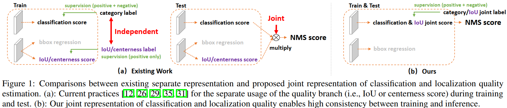
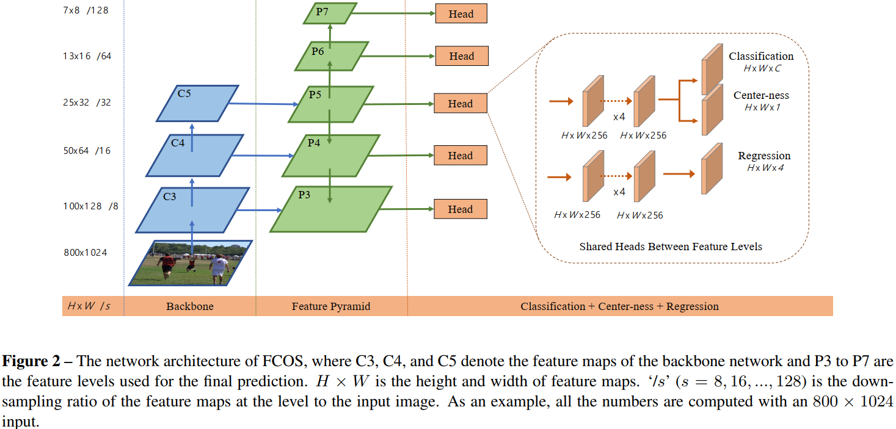

# 目标检测

## 概述

## 论文

### 20201125 GFLV2

[Generalized Focal Loss V2: Learning Reliable Localization Quality Estimation for Dense Object Detection](https://arxiv.org/abs/2011.12885)

### 20200608 GFL

#### 1 概述

[Generalized Focal Loss: Learning Qulified and Distributed Bounding Boxes for Dense Object Detection](https://arxiv.org/abs/2006.04388)指出location quality prediction训练、推理存在不一致，regression现有Dirac delta distribution不够灵活，提出class-quality联合表示及regression arbitrary distribution来解决上述问题，并提出GFL来计算新的损失进行优化。

#### 2 主要内容

* GFL

假设真实标注$y \in [y_l, y_r]$的预测结果定义为$\hat{y} = y_lp_l + y_rp_r$，其中$p_l + p_r = 1$，则GFL表示为：

$\text{GFL}(p_l, p_r) = -|y - \hat{y}|^\beta((y_r - y)\log(p_l) + (y - y_l)\log(p_r))$

上述损失的最小值在$p_l = \frac{y_r - y}{y_r - y_l}, p_r = \frac{y - y_l}{y_r - y_l}$取得，此时，$\hat{y} = y$。

* classification & iou joint score

分类与定位质量的关系如下图所示。现有工作中，训练时分类与定位质量是独立训练的，而在推理时两者相乘再作NMS。这造成训练与推理的不一致，此外，现有工作仅对正样本的定位质量计算损失，这会出现低分类score高定位质量的现象。

为解决上述问题，论文提出分类-定位质量联合表示，即$y=0$表示负样本且定位质量为0，$0 < y \leq 1$表示正样本且与GT的IoU为$y$。

论文采用QFL计算上述表示的损失，即$\text{QFL}(\sigma) = -|y - \sigma|^\beta((1 - y)\log(1 - \sigma) + y\log(\sigma))$。其中，取$\beta = 2$。



* regression arbitrary distribution

论文定义检测框边界的distance预测值为$\hat{y} = \sum_{i = 0}^nP_iy_i$，其中$P_i$是定义在$0,1,...,n$上的一个离散分布（即$\sum_{i = 0}^nP_i = 1$），论文取$\Delta = y_i - y_{i - 1} = 1$。

论文采用GIoU Loss来计算检测框的损失。考虑到distance的分布通常会比较接近GT且“compact”，论文引入DFL促使$P_i$的分布趋向于上述形态，即$\text{DFL}(P_i, P_{i + 1}) = -((y_{i + 1} - y)\log(P_i) + (y - y_i)\log(P_{i + 1}))$，其中$y$是真实标注，$y_i, y_{i+1}$紧邻真实标注。

* 训练与推理

论文最终损失定义为$L = (\sum \text{QFL} + \sum \mathbb{1}_{c > 0}(\lambda_0\text{GIoU} + \lambda_1\text{DFL}))/N_{pos}$，其中取$\lambda_0 = 2, \lambda_1 = 1/4$，另外在训练中quality score会用于weight GIOU和DFL损失。

推理时，直接使用分类与定位质量分支的结果作为NMS的score。

#### 3 主要结果

* “分类与定位质量联合表示 + QFL”优于centerness或iou分支、centerness或iou-guided；
* “arbitrary distribution + DFL”优于Dirac delta、Gaussian等；
* GFL总体结果优于ATSS。

#### 4 阅读小记

GFL是一种通用的损失函数，论文将其分别应用于分类-定位质量分支（QFL）、回归分支（DFL），其中QFL由于class imbalance采用$\beta = 2$，而DFL不涉及上述问题，所以采用$\beta = 0$。


### 20191205 ATSS

#### 1 概述

[Bridging the Gap Between Anchor-based and Anchor-free Detection via Adaptive Training Sample Selection](https://arxiv.org/abs/1807.08865)指出Anchor-based (RetinaNet)及Anchor-free (FCOS)核心区别在于正负样本的定义不同，提出ATSS (Adaptive Training Sample Selecetion)根据统计信息确定目标的正负样本。

#### 2 主要内容

* RetinaNet与FCOS

论文通过实验证明，如下方法对RetinaNet和FCOS同样有效：GroupNorm、GIoU Loss、In GT Box、Centerness、Regression Scalar。

RetinaNet与FCOS的主要区别在于：1) 正负样本的定义不同，RetinaNet基于IoU，FCOS基于各层的scale range；2) 回归的方式不同，RetinaNet采用Anchor与GT中心及高宽的offset，FCOS采用pixel到GT各边的distance。论文通过实验证明，它们的核心区别在于正负样本的定义不同，而回归方式对结果的影响不大。

* ATSS

ATSS主要步骤为：1) 对每个GT，在FPN各层选择$k$个最接近中心的anchor作为候选；2) 统计GT所有$k \times L$个候选anchor的IoU均值$m_g$及标准差$v_g$；3) 对每个GT，将满足$\text{IoU} \geq m_g + v_g$并且中心点位于GT中的候选作为正样本；4) 若某anchor选作多个GT的正样本，选择最高IoU的GT作为其目标；5) 其余作为负样本。

上述策略的设计基于如下经验：1) 靠近GT中心的Anchor更好，Anchor中心位于GT更好；2) $m_g + v_g$作为阈值，$m_g$描述了anchor与GT匹配的总体质量，$v_g$描述了各层anchor与GT匹配的差异，进而从各层动态选择出最优的Anchor作为正样本；3) 固定选择k个anchor作为候选，使得大目标、小目标具有相当数量的正样本，避免大目标正样本过多。

```{note}
无论是Archor-based还是Anchor-free，在ATSS中，每个样本点均采用$8S$的单个Anchor作Assignment。
```

#### 3 主要结果

* RetinaNet、FCOS采用ATSS均优于不采用ATSS；
* $k$的选择不易过小（统计信息不稳定）、过大（出现低质量正样本），论文采用9最优；
* 单个Anchor的大小及ratio变化对结果的影响不大，论文采用$8S$的方形anchor；
* RetinaNet采用ATSS后，使用单个anchor和多个anchor的效果无差异，若不采用ATSS，多个anchor优于单个anchor；
* ATSS优于FCOS、RetinaNet、CornerNet、Cascade R-CNN等。

#### 4 阅读小记

FCOS及RetinaNet在Assignment时，需要按照人工设置的阈值确定正负样本，ATSS避免了这些人工设置，能够动态选择每个GT的正负样本。


### 20190402 FCOS

#### 1 概述

[FCOS: Fully Convolutional One-Stage Object Detection](https://arxiv.org/abs/1904.01355)提出Center-ness抑制Archor-Free引入的低质量预测框，构建了全卷积一阶段目标检测模型。

#### 2 主要内容

* 模型

FCOS模型整体结构如下图所示，其中：1) Backbone采用ResNet、ResNeXt；2) Neck采用FPN；3) Head采用Archor-Free，具有分类、回归、Center-ness三个分支，其中分类与Center-ness共享参数。

FCOS直接将特征图中的每个像素作为一个样本点，预测样本点的类别、距边界框的距离、Center-ness。

Center-ness用于衡量样本点的“中心程度”，定义为$centerness = \sqrt{\frac{\min(l, r)}{\max(l, r)} \times \frac{\min(t, b)}{\max(t, b)}}$。

回归分支通过$e^x$将值映射到$\mathbb{R}^+$，论文考虑到FPN各层尺度不一，引入trinable scalar $s_i$来调整上述值，即$e^{s_ix}$。



```{note}
Center-ness与regression共享参数能获得更好的精度。
```

* 训练

Assignment策略：1) 位于GT Box中的点视为正样本；2) FPN各层视GT Box中一定尺度范围内[$m_{i-1}, m_i$]的点为正样本，论文中设置$m_2=0, m_3=64, m_4=128, m_5=256, m_6=512, m_7=\infty$；3) 若某点属于多个GT，选择最小面积的GT作为其Target。

损失包括三部分：1) 分类损失采用Focal Loss；2) 回归损失采用IOU loss；3) Center-ness采用Binary交叉熵（BCE）。

* 推理

Center-ness输出结果与分类预测结果相乘，作为NMS的score，其余处理与RetinaNet类似。

#### 3 主要结果

* FCOS的BPR(Best Possible Recall)优于RetinaNet(Archor-based)；
* 借助FPN，FCOS能够有效缓解Ambiguous Samples问题（降至7.14%，若仅考虑不同类别的Ambiguous Samples，则为3.75%）；
* 采用Center-ness分支能够提升AP 3.6，但是通过regression的结果来计算center-ness无效果；
* FCOS的模型精度优于CornerNet、RetinaNet、Faster R-CNN等。

#### 4 阅读小记

FCOS采用下述方法能够进一步提升精度：1) 基于$P_5$计算$P_6, P_7$；2) 采用Group Normalization；3) center-ness与regression共享参数；4) 采用GIoU Loss；5) 采用FPN levels对回归目标作normalization。


### 20170807 Focal Loss (RetinaNet)

#### 1 概述

[Focal Loss for Dense Object Detection](https://arxiv.org/abs/1708.02002)指出class imbalance是损害一阶段目标检测模型精度的主要原因，提出Focal Loss来解决class imbalance问题，并构建一阶段目标检测模型RetinaNet，证明了Focal Loss的有效性。

#### 2 主要内容

* Focal Loss

记模型类别预测概率为：

$p_t = \begin{cases}
p & y = 1 \\
1 - p & otherwise \\
\end{cases}$

则传统的交叉熵Cross Entropy (CE)可以表示为$\text{CE}(p_t) = -\log(p_t)$，Balanced CE可以表示为$\text{CE}(p_t) = -\alpha_t \log(p_t)$（其中，$\alpha_t$的定义与$p_t$类似，用于调整正负样本的权重）。

论文定义Focal Loss为$\text{FL}(p_t) = -(1 - p_t)^\gamma \log(p_t)$，用于down-weight easy example（如下图所示），使得模型训练关注于hard negatives，以解决class imbalance问题。


在实践中，论文采用Balaced FL，即$\text{FL}(p_t) = -\alpha_t(1 - p_t)^\gamma \log(p_t)$，其中取$\gamma = 2, \alpha = 0.25$。

```{note}
为提升Focal Loss训练的稳定性，论文在初始化classification layer时，会将少数类（即前景类）的预测概率初始化为一个较小的值，例如0.01，使得模型在初始时就关注少数类。
```

* RetinaNet

RetinaNet整体结构如下图所示，Backbone采用ResNet，Neck采用FPN，Head是Anchor-based（$A=9$），具有分类与框回归（class-agnostic）两个分支，两个分支网络结构相同，参数不共享。

模型训练时，Anchor Assignment基于iou（0.5作为前景阈值，0.4作为背景阈值，未assigned的archor在训练中忽略），损失包括两部分：分类的Focal Loss以及框回归的损失，其中Focal Loss基于assigned前景的anchor的数量作normalized，而不是全部anchor。

模型推理时，各scale仅保留阈值0.05以上最多1k的预测结果，合并后作NMS，以提高推理速度。


#### 3 主要结果

* Balanced FL优于Balanced CE；
* 9个Anchor的结果优于单个Anchor；
* FL优于OHEM等其它解决一阶段目标检测class imbalance的方法；
* RetinaNet+FL具有一阶段目标检测的速度与二阶段目标检测的精度。

#### 4 阅读小记

二阶段目标检测模型通过Region Proposal及Sampling规避了class imbalance问题，Focal Loss为一阶段目标检测提供了一种解决class imbalance的方法。


### 20161225 YOLOV2

[YOLO9000: Better, Faster, Stronger](https://arxiv.org/abs/1612.08242)

### 20150608 YOLO

#### 1 概述

[You Only Look Once: Unified, Real-Time Object Detection](https://arxiv.org/abs/1506.02640)提出高效的一阶段目标检测模型用于实时目标检测。

#### 2 主要内容

* 模型

YOLO基本思想如下图所示，输入图片划分为$S \times S$个网格（grid cell），每个网格预测$B$个Bounding Box，每个检测框包含$x, y \in [0, 1]$（相对于网格）、$w, h \in [0, 1]$（相对于图片）、$confidence = \Pr(\text{Object}) \times \text{IOU}_{\text{pred}}^{\text{truth}}$5个值）和$C$个类别概率$\Pr(\text{Class}_i|\text{Object})$。

网格中每个检测框的confidence与每个类别的预测概率相乘即可得到$\Pr(\text{Class}_i) \times \text{IOU}_{\text{pred}}^{\text{truth}}$，该值综合描述了每个检测框的class与location。


YOLO模型结构如下图所示，图片经resize后，输入CNN+FC组成的网络，输出大小为$S^2(5B + C)$的Tensor。


* 训练

Assignment策略：目标中心所在网格负责该目标的检测（即$\mathbb{1}_{i}^\text{obj}$），进一步，该网格中与GT的IOU最高的Box负责该目标的检测（即$\mathbb{1}_{ij}^\text{obj}$）。

损失函数基于Sum-Squared Error，包括三个部分：$L = L_{\text{coord}} + L_{\text{confidence}} + L_{class}$。其中：

$L_\text{coord} = \lambda_{\text{coord}}\sum_{i=0}^{S^2} \sum_{j=0}^{B} \mathbb{1}_{ij}^\text{obj}[(x_i - \hat{x}_i)^2 + (y_i - \hat{y}_i)^2 + (\sqrt{w_i} - \sqrt{\hat{w}_i})^2 + (\sqrt{h_i} - \sqrt{\hat{h}_i})^2]$

$L_{\text{confidence}} = \sum_{i=0}^{S^2} \sum_{j=0}^{B} (\mathbb{1}_{ij}^\text{obj}+ \lambda_{\text{noobj}}\mathbb{1}_{ij}^\text{noobj})(C_i - \hat{C}_i)^2 $

$L_{class} = \sum_{i=0}^{S^2} \sum_{c \in \text{classes}}(p_i(c) - \hat{p}_i(c))^2$

```{note}
论文设$\lambda_{\text{coord}} = 5$，以平衡coord损失与其它损失；论文设$\lambda_{\text{noobj}} = 0.5$，以减小不含目标网格对应confidence损失；论文将$w, h$开方，以平衡大目标与小目标的损失。
```

* 推理

YOLO输出$S^2B$个检测框和对应的类别概率，经NMS后得到最终检测结果。

#### 3 主要结果

* YOLO与Fast/Faster R-CNN相比，推理速度快，模型精度低；
* YOLO与Fast R-CNN相比，定位效果差，但不易犯False Positive错误；
* YOLO与R-CNN相比，泛化到Art等数据场景效果好。

#### 4 阅读小记

* YOLO系列的开山之作；
* YOLO未采用Anchor，而是基于Grid Cell对检测框进行约束；
* 论文指出YOLO的几个缺陷：1) Cell约束了检测结果的数量，导致YOLO难以预测紧凑在一起小目标；2) Box坐标是基于数据习得的，难以泛化到未见到过的size与ratio；3) 虽然开方了，大小目标coord的损失依旧不够平衡。