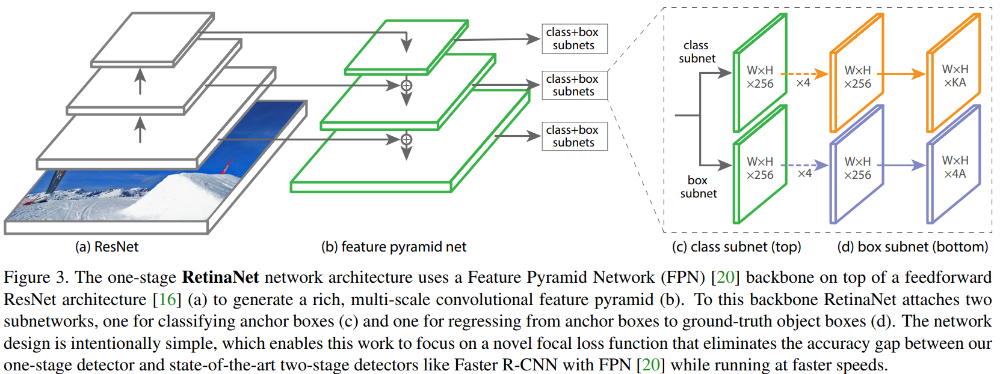

# 目标检测

## 概述

## 论文

### 20170807 Focal Loss (RetinaNet)

#### 1 概述

[Focal Loss for Dense Object Detection](https://arxiv.org/abs/1708.02002)指出class imbalance是损害一阶段目标检测模型精度的主要原因，提出Focal Loss来解决class imbalance问题，并构建一阶段目标检测模型RetinaNet，证明了Focal Loss的有效性。

#### 2 主要内容

* Focal Loss

记模型类别预测概率为：

$p_t = \begin{cases}
p & y = 1 \\
1 - p & otherwise \\
\end{cases}$

则传统的交叉熵Cross Entropy (CE)可以表示为$\text{CE}(p_t) = -\log(p_t)$，Balanced CE可以表示为$\text{CE}(p_t) = -\alpha_t \log(p_t)$（其中，$\alpha_t$的定义与$p_t$类似，用于调整正负样本的权重）。

论文定义Focal Loss为$\text{FL}(p_t) = -(1 - p_t)^\gamma \log(p_t)$，用于down-weight easy example（如下图所示），使得模型训练关注于hard negatives，以解决class imbalance问题。


在实践中，论文采用Balaced FL，即$\text{FL}(p_t) = -\alpha_t(1 - p_t)^\gamma \log(p_t)$，其中取$\gamma = 2, \alpha = 0.25$。

```{note}
为提升Focal Loss训练的稳定性，论文在初始化classification layer时，会将少数类（即前景类）的预测概率初始化为一个较小的值，例如0.01，使得模型在初始时就关注少数类。
```

* RetinaNet

RetinaNet整体结构如下图所示，Backbone采用ResNet，Neck采用FPN，Head是Anchor-based（$A=9$），Assignment基于iou（正样本阈值为0.5，负样本为0.4，其余未assigned在训练中忽略），损失包括两部分：分类的Focal Loss以及框回归的损失（class-agnostic）。



```{note}
模型训练时，Focal Loss基于assigned anchor的数量作normalized，而不是全部anchor。

模型推理时，各scale仅保留阈值0.05以上最多1k的预测结果，以提高推理速度。
```

#### 3 主要结果

* Balanced FL优于Balanced CE；
* 9个Anchor的结果优于单个Anchor；
* FL优于OHEM等其它解决一阶段目标检测class imbalance的方法；
* RetinaNet+FL具有一阶段目标检测的速度与二阶段目标检测的精度。

#### 4 阅读小记

二阶段目标检测模型通过Region Proposal及Sampling规避了class imbalance问题，Focal Loss为一阶段目标检测提供了一种解决class imbalance的方法。
